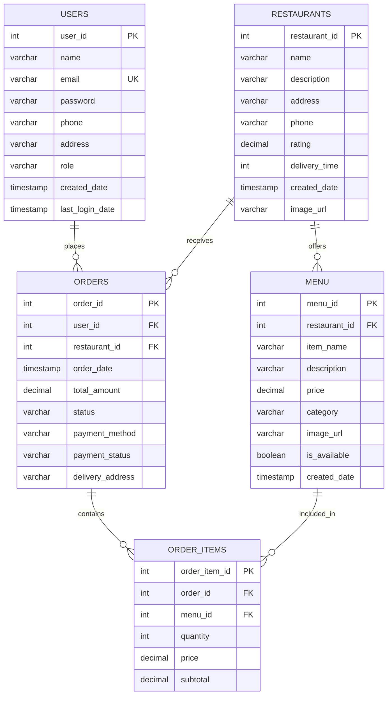

# 🍔 FAah!! FOOD

> A full-stack food ordering web application built with Java, JSP, Jakarta Servlets, JDBC and MySQL, deployed with Docker and Render.

[](https://faahfoodweb.onrender.com)
[](https://www.oracle.com/java/)
[](https://tomcat.apache.org/)
[](https://www.mysql.com/)
[](https://render.com/)

## 🚀 Live Demo

**[Open FAah!! FOOD](https://faahfoodweb.onrender.com)**

> The live application is hosted on Render. The free instance may take some time to wake up after a period of inactivity.

---

## 📖 About

**FAah!! FOOD** is a full-stack food ordering web application that demonstrates a traditional Java web architecture using JSP, Jakarta Servlets, JDBC, DAO layers and MySQL.

Users can create an account, log in, browse restaurants and menus, manage a restaurant-specific cart, proceed through checkout, place orders and view their order history.

The application is deployed as a Dockerized Tomcat application on Render and uses a managed MySQL database in production.

---

## ✨ Features

- User registration and login
- BCrypt-based password hashing in the application authentication flow
- Session-based user authentication
- Restaurant listing
- Restaurant-specific menu browsing
- Add items to cart
- Increase/decrease cart quantities
- Remove items and clear cart
- Restaurant-aware cart handling
- Checkout and delivery details
- Order placement
- Order confirmation
- My Orders / order history
- MySQL persistence through JDBC
- Production database connectivity through environment variables
- Docker-based deployment
- Automatic deployment from the `main` branch through Render

---

## 🛠️ Tech Stack

### Frontend

- HTML
- CSS
- JavaScript
- JSP (JavaServer Pages)

### Backend

- Java 21
- Jakarta Servlets
- JDBC
- DAO / DAO Implementation pattern
- Service-layer package
- Session-based authentication

### Database

- MySQL
- MySQL Connector/J 9.7.0

### Server & Deployment

- Apache Tomcat 10.1
- Docker
- Render

### Production Database

- Aiven MySQL

---

## 🏗️ System Architecture

FAah!! FOOD follows a layered Java web architecture:

```text
┌──────────────────────────────┐
│          Browser             │
│       HTML / CSS / JS        │
└──────────────┬───────────────┘
               │
               ▼
┌──────────────────────────────┐
│             JSP              │
│ Presentation / UI Layer      │
└──────────────┬───────────────┘
               │
               ▼
┌──────────────────────────────┐
│        Controllers           │
│     Jakarta Servlets        │
└──────────────┬───────────────┘
               │
               ▼
┌──────────────────────────────┐
│          Services            │
│      Business Logic          │
└──────────────┬───────────────┘
               │
               ▼
┌──────────────────────────────┐
│            DAO               │
│     Database Operations      │
└──────────────┬───────────────┘
               │
               ▼
┌──────────────────────────────┐
│            JDBC              │
│      MySQL Connectivity      │
└──────────────┬───────────────┘
               │
               ▼
┌──────────────────────────────┐
│       MySQL Database         │
│  Local MySQL / Aiven MySQL   │
└──────────────────────────────┘
```

### Production Architecture

```text
Developer
   │
   │ git push
   ▼
GitHub (main)
   │
   │ automatic deployment
   ▼
Render
   │
   ▼
Docker Container
   │
   ▼
Apache Tomcat 10.1
   │
   ▼
FAah!! FOOD Application
   │
   │ JDBC + SSL
   ▼
Aiven MySQL
```

---

## 🗄️ Database Architecture

FAah!! FOOD uses five relational tables:

- `users`
- `restaurants`
- `menu`
- `orders`
- `order_items`

### Entity Relationship Diagram



### Relationships

| Relationship | Description |
|---|---|
| `users → orders` | One user can place many orders |
| `restaurants → menu` | One restaurant can offer many menu items |
| `restaurants → orders` | One restaurant can receive many orders |
| `orders → order_items` | One order can contain multiple order items |
| `menu → order_items` | One menu item can appear in multiple order items |

### Database Schema

A clean, data-free schema is available at:

```text
database/schema.sql
```

The schema file is intended for local setup and documentation. It does **not** contain production user records, passwords, addresses or order data.

---

## 📁 Project Structure

```text
Faahfoodweb/
│
├── src/
│   └── main/
│       ├── java/
│       │   └── com/food/
│       │       ├── controller/
│       │       │   ├── AccountCheckController.java
│       │       │   ├── CartController.java
│       │       │   ├── CheckoutController.java
│       │       │   ├── LoginController.java
│       │       │   ├── LogoutController.java
│       │       │   ├── MenuController.java
│       │       │   ├── MyOrdersController.java
│       │       │   ├── OrderConfirmationController.java
│       │       │   ├── PaymentController.java
│       │       │   ├── RestaurantController.java
│       │       │   └── SignupController.java
│       │       │
│       │       ├── dao/
│       │       │   ├── MenuDAO.java
│       │       │   ├── OrderDAO.java
│       │       │   ├── OrderItemDAO.java
│       │       │   ├── RestaurantDAO.java
│       │       │   └── UserDAO.java
│       │       │
│       │       ├── daoimpl/
│       │       │   ├── MenuDAOImpl.java
│       │       │   ├── OrderDAOImpl.java
│       │       │   ├── OrderItemDAOImpl.java
│       │       │   ├── RestaurantDAOImpl.java
│       │       │   └── UserDAOImpl.java
│       │       │
│       │       ├── model/
│       │       │   ├── Cart.java
│       │       │   ├── CartItem.java
│       │       │   ├── Menu.java
│       │       │   ├── Order.java
│       │       │   ├── OrderItem.java
│       │       │   ├── Restaurant.java
│       │       │   └── User.java
│       │       │
│       │       ├── service/
│       │       └── util/
│       │           └── DBConnection.java
│       │
│       └── webapp/
│           ├── common/
│           │   ├── footer.jsp
│           │   └── navbar.jsp
│           ├── css/
│           │   └── style.css
│           ├── images/
│           ├── js/
│           │   └── app.js
│           ├── META-INF/
│           ├── WEB-INF/
│           │   ├── lib/
│           │   └── web.xml
│           ├── account-check.jsp
│           ├── cart.jsp
│           ├── checkout.jsp
│           ├── login.jsp
│           ├── menu.jsp
│           ├── my-orders.jsp
│           ├── order-confirmation.jsp
│           ├── payment.jsp
│           ├── restaurants.jsp
│           └── signup.jsp
│
├── database/
│   └── schema.sql
│
├── Dockerfile
├── .gitignore
└── README.md
```

---

## 🔄 Application Flows

### Authentication

```text
Signup
  ↓
SignupController
  ↓
UserDAO / UserDAOImpl
  ↓
JDBC
  ↓
users table
```

```text
Login
  ↓
LoginController
  ↓
UserDAO / UserDAOImpl
  ↓
BCrypt password verification
  ↓
Session
```

### Restaurant & Menu Browsing

```text
Restaurants Page
  ↓
RestaurantController
  ↓
RestaurantDAO
  ↓
restaurants table
```

```text
Menu Page
  ↓
MenuController
  ↓
MenuDAO
  ↓
menu table
```

### Cart & Checkout

```text
Menu
  ↓
CartController
  ↓
Session Cart
  ↓
CheckoutController
  ↓
Checkout Page
  ↓
PaymentController
```

### Order Placement

```text
PaymentController
       │
       ├── OrderDAO
       │      ↓
       │   orders
       │
       └── OrderItemDAO
              ↓
          order_items
              │
              ▼
     Order Confirmation
              │
              ▼
          My Orders
```

---

## 🌐 Servlet Endpoints

| Endpoint | Controller | Purpose |
|---|---|---|
| `/restaurant` | `RestaurantController` | Load restaurants |
| `/menu` | `MenuController` | Load restaurant menu |
| `/signup` | `SignupController` | Register user |
| `/login` | `LoginController` | Authenticate user |
| `/logout` | `LogoutController` | End user session |
| `/account-check` | `AccountCheckController` | Account/session checks |
| `/cart` | `CartController` | Manage cart |
| `/checkout` | `CheckoutController` | Checkout flow |
| `/payment` | `PaymentController` | Place/process order |
| `/order-confirmation` | `OrderConfirmationController` | Display order confirmation |
| `/my-orders` | `MyOrdersController` | Display order history |

---

## ⚙️ Local Setup

### Prerequisites

Install:

- Java 21 or later
- Eclipse IDE with Dynamic Web Project support
- Apache Tomcat 10.1
- MySQL 8.0+
- Git

### 1. Clone the repository

```bash
git clone https://github.com/sksahabaz/Faahfoodweb.git
cd Faahfoodweb
```

### 2. Import into Eclipse

Import the project as an existing Eclipse project / Dynamic Web Project.

Configure Apache Tomcat 10.1 as the server runtime.

### 3. Create the local database

Open MySQL Workbench and run:

```sql
SOURCE database/schema.sql;
```

Or open `database/schema.sql` and execute it manually.

### 4. Create the application database user

For local development, create a dedicated MySQL application user and grant it access only to the application database.

Example:

```sql
CREATE USER 'faah_app'@'localhost' IDENTIFIED BY 'your_password';
GRANT ALL PRIVILEGES ON faahfood.* TO 'faah_app'@'localhost';
FLUSH PRIVILEGES;
```

### 5. Configure environment variables

The application reads database credentials from environment variables.

```text
DB_URL=jdbc:mysql://localhost:3306/faahfood
DB_USER=faah_app
DB_PASSWORD=your_password
```

Do not commit real credentials to GitHub.

### 6. Run the application

Start the project using Apache Tomcat 10.1 from Eclipse.

The application uses the `/restaurant` servlet as the configured welcome entry point.

---

## 🔐 Configuration & Security

Database credentials are intentionally not hardcoded in the application.

`DBConnection.java` reads:

```text
DB_URL
DB_USER
DB_PASSWORD
```

Production values are configured through Render environment variables.

Never commit:

- Database passwords
- `.env` files
- Production credentials
- Private database dumps
- Real user data

---

## 🚀 Deployment

The production deployment uses:

```text
GitHub
   ↓
Render
   ↓
Docker
   ↓
Apache Tomcat 10.1
   ↓
FAah!! FOOD
   ↓
Aiven MySQL
```

### Automatic Deployment

The `main` branch is connected to Render.

The normal development workflow is:

```bash
git add .
git commit -m "Describe your change"
git push origin main
```

After the push:

```text
GitHub
  ↓
Render detects commit
  ↓
Docker image/build
  ↓
Tomcat application starts
  ↓
New version becomes live
```

### Production Database

The production application connects to Aiven MySQL using environment variables and an SSL-enabled JDBC connection.

---

## 🧪 Application Flow Checklist

The deployed application has been tested through the main user flow:

- [x] User registration
- [x] User login
- [x] Restaurant browsing
- [x] Menu browsing
- [x] Add to cart
- [x] Update cart quantity
- [x] Remove cart items
- [x] Checkout
- [x] Order placement
- [x] Order confirmation
- [x] My Orders
- [x] Logout
- [x] Production database persistence

---

## 📸 Screenshots

### Home

Add the project homepage screenshot here.

### Restaurants

Add the restaurants page screenshot here.

### Menu

Add the menu page screenshot here.

### Cart

Add the cart screenshot here.

### Checkout

Add the checkout screenshot here.

### Order Confirmation

Add the order confirmation screenshot here.

### Authentication

Add login/signup screenshots here.

> Recommended repository path:
>
> `docs/screenshots/`

---

## 🔮 Future Improvements

Potential future improvements include:

- Online payment gateway integration
- Restaurant/admin dashboard
- Order status tracking
- Search and filtering
- Reviews and ratings
- Email/order notifications
- Improved authorization and role-based access
- Production-ready image storage
- Additional validation and error handling

---

## 👨‍💻 Author

**Shekh Shahabaz**

- GitHub: [@sksahabaz](https://github.com/sksahabaz)

---

## 📄 License

This project is developed as a portfolio/learning project.

If you plan to distribute or reuse the project, add an appropriate open-source license to the repository.

---

## ⭐ Support

If you find the project useful or interesting, consider giving the repository a ⭐ on GitHub.
